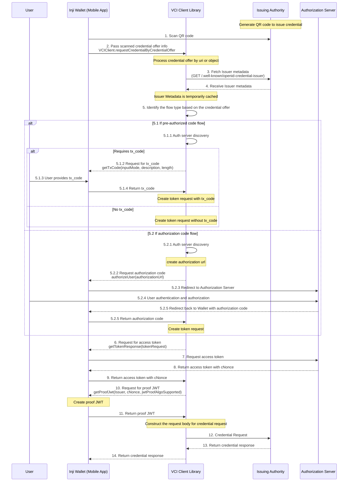

## Support of credential offer

This document provides a comprehensive overview of downloading the credential issued from Issuing Authority through credential offer.

### Authorization Support
1. Authorization Code Flow
2. Pre-Authorized Code Flow

### Out of scope
1. Batch credential download

### Actors involved
1. Inji Wallet
2. _inji-vci-client_ (Library for downloading credential)
3. Issuing authority


###  Sequence diagram - download credential issued through credential offer for pre-authorized code flow and authorization code flow




### Steps involved

**Prerequisite -** Generate QR code to issue credential

#### 1.  Scan QR code

Wallet scans QR code generated by issuer

````
{  
    "credential_issuer": "https://example.com/issuer",
    "credential_configuration_ids": [
        "credential-config-id"
    ],
    "grants": {
        "urn:ietf:params:oauth:grant-type:pre-authorized_code": {
            "pre-authorized_code": "412350404962811318869516",
            "authorization_server": "https://example.com/authserver"
        }
    }
}
````
#### 2. Pass scanned credential offer info

After scanning the QR code, pass credential offer info _inji-vci-client_.

````
VCIClient.requestCredentialByCredentialOffer(
  credentialOffer,
  clientMetadata,
  getTxCode,
  authorizeUser: () -> authcode,
  getTokenResponse: () -> tokenResponse,
  getProofJwt: () -> proof,
  onCheckIssuerTrust: () -> boolean,
)

Note: 
- credentialOffer is credential offer data or uri received from issuer.
- clientMetadata, If it is authorization code flow for client authentication - client-id and redirect-uri
- getTxCode is a callback function to get the tx_code from the user if required.
- authorizeUser is a callback function to authorize the user for the credential request and return authorization code.
- getTokenResponse is a callback function to get the token response from the authorization server.
- getProofJwt is a callback function to create the proof JWT for the credential request.
- onCheckIssuerTrust is a callback function to check if the issuer is trusted or not.

````
#### 3. Fetch Issuer metadata<br/>(GET /.well-known/openid-credential-issuer)
The _inji-vci-client_ fetches the Issuer metadata from the issuing authority to understand the capabilities and requirements for credential issuance.

````
GET credentialIssuer/.well-known/openid-credential-issuer
````

#### 4. Receive Issuer metadata
inji-vci-client receives Issuer's metadata response.

```
{  
    "credential_issuer": "https://example.com/issuer",
    "credential_endpoint": "https://example.com/issuer/credential",    
    "credential_configurations_supported": {
      "credential-config-id": {
        "format": "ldp_vc",
        "scope": "vc_scope",
        "credential_definition": {
            "credentialSubject": {
                "cliam1": {
                    "display": [
                    {
                        "name": "Claim 1",
                        "locale": "en"
                    }
                    ]
                },
                "claim2": {
                    "display": [
                    {
                        "name": "Claim 1",
                        "locale": "en"
                    }
                    ]
                }
            }
        }
      }
    }
}
```

#### 5. Identify the flow type based on the credential offer

##### 5.1 pre-authorized code flow
If credential offer is created with pre-authorized code

###### 5.1.1 Auth server discovery
The _inji-vci-client_ performs an authorization server discovery to determine the authorization server's endpoint.

```
GET authserver/.well-known/oauth-authorization-server

{
  "issuer": "https://example.com/issuer",
  "authorization_endpoint": "https://example.com/authserver/authorize",
  "token_endpoint": "https://example.com/authserver/token",
  "grant_types_supported": [
      "authorization_code"
  ],
  "response_types_supported": [
      "code"
  ]
}
```

###### 5.1.2 Request for tx_code if required
_inji-vci-client_ requests a transaction code (tx_code) from the Wallet through getTxCode callback.


###### 5.1.3 User provides tx_code
Wallet prompts screen to accept transaction code. User enters the tx_code received from the issuing authority.

```
{
    "tx_code": "412350404962811318869516"
}
```

###### 5.1.4 Return tx_code
Wallet returns the tx_code to the _inji-vci-client_. After receiving tx_code, _inji-vci-client_ creates token request

##### 5.2 authorization code flow
If credential offer is created with authorization code flow

###### 5.2.1 Auth server discovery
The _inji-vci-client_ performs an authorization server discovery to determine the authorization server's endpoint.

```
GET authserver/.well-known/oauth-authorization-server

{
  "issuer": "https://example.com/issuer",
  "authorization_endpoint": "https://example.com/authserver/authorize",
  "token_endpoint": "https://example.com/authserver/token",
  "grant_types_supported": [
      "authorization_code"
  ],
  "response_types_supported": [
      "code"
  ]
}
```

###### 5.2.2 Request authorization code
The _inji-vci-client_ creates an authorization URL and requests the Wallet to redirect the user to the authorization server.

````
{
    "response_type": "code",
    "client_id": "your-client-id",
    "redirect_uri": "https://your-redirect-uri.com",
    "scope": "openid vc_scope",
    "state": "random_state_value"
    "code_challenge_method": "S256"
    "code_challenge": "random string",
    "nonce": "random string"
}
````

###### 5.2.3 Redirect to Authorization Server
The Wallet redirects the user to the authorization server with the authorization URL.

###### 5.2.4 User authentication and authorization
The user provide details for authenticates & authorization 

###### 5.2.5 Redirect back to Wallet with authorization code
User is redirected back to the Wallet with the authorization code.

```
{
    "code": "authorization_code_value"
}
```

#### 6. Request for access token<br/>getTokenResponse(tokenRequest)
The _inji-vci-client_ requests an access token from the authorization server through Wallet by using getTokenResponse callback

#### 7. Request access token
The Wallet sends a request to the authorization server to obtain an access token.

#### 8. Return access token with cNonce
The authorization server returns the access token along with a cNonce (client nonce) to the Wallet.

```
{
    "access_token": "access_token_value",
    "c_nonce": "c_nonce_value"
}
```

#### 9. Return access token with cNonce
The wallet returns the access token along with a cNonce (client nonce) to the _inji-vci-client_.

#### 10. Request proof JWT
The _inji-vci-client_ requests proof jwt based on jwt algorithms supported by Issuer.

#### 11. Return proof JWT
The wallet returns the proof JWT to the _inji-vci-client_.

#### 12. Credential Request
The _inji-vci-client_ constructs the request body for the credential request using the access token and cNonce. 
It then sends the credential request to the issuing authority.

Request is constructed based on credential format - ldp_vc, mso_mdoc.

#### 13. Return credential response
The issuing authority processes the credential request and returns the credential response to the _inji-vci-client_.
Credential response is json if credential format is ldp_vc, and it's base64 url encoded CBOR data if credential format is mso_mdoc.

```
{  
    "credential": "....."
}
```

#### 14. Return credential response
The _inji-vci-client_ returns the credential response to the Wallet.

```
{  
    "credential": ".....",
    "credentialConfigurationId": "credential-config-id",
    "credentialIssuer": "https://example.com/issuer"
}  
```